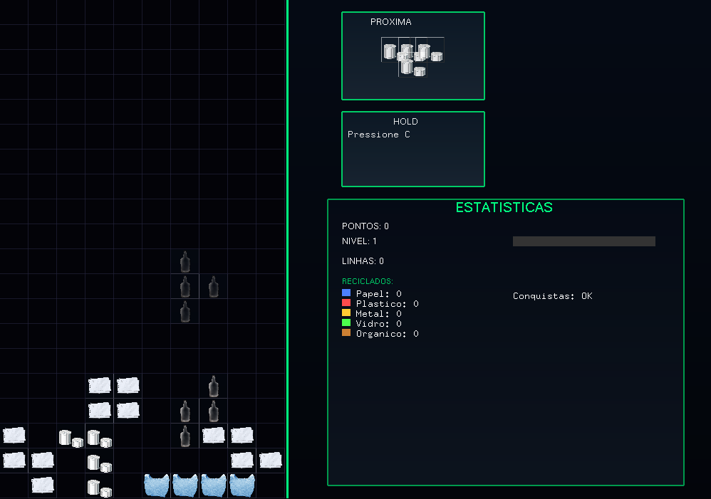

# 🌱 EcoTetris v2.0 - Reciclagem Sustentável

Bem-vindo ao **EcoTetris v2.0**, um jogo de Tetris com temática de **reciclagem sustentável**. A cada peça encaixada, você ajuda o planeta a se tornar um lugar mais limpo e organizado!

---


## Compilação:
```bash
g++ main.cpp game.cpp -o Tetris -lglut -lGLU -lGL -lstdc++
```

Depois basta executar:
```bash
./Tetris
```

## 🎮 Controles do Jogo

| Tecla        | Ação                        |
|--------------|-----------------------------|
| ⬅️ ➡️ ⬆️ ⬇️ | Mover e rotacionar peças     |
| **Espaço**   | Drop rápido (queda instantânea) |
| **C**        | Hold (guardar peça)         |
| **ESC**      | Pausar / Abrir menu         |
| **S**        | Salvar manualmente o progresso |
| **L**        | Carregar save manual        |
| **Q**        | Sair do jogo                |
| **R**        | Reiniciar partida           |

---

## 🖼️ Tela do Jogo



---

## ♻️ Objetivo

O objetivo é organizar as peças com consciência ambiental, representando a separação e empilhamento correto de materiais recicláveis. Cada peça representa um tipo de resíduo!

---

## 💾 Sistema de Save

- Você pode salvar a qualquer momento com **S**
- Carregue seu progresso com **L**

---

## 📜 Licença

Este projeto é open source e pode ser usado e modificado livremente com créditos.

---

